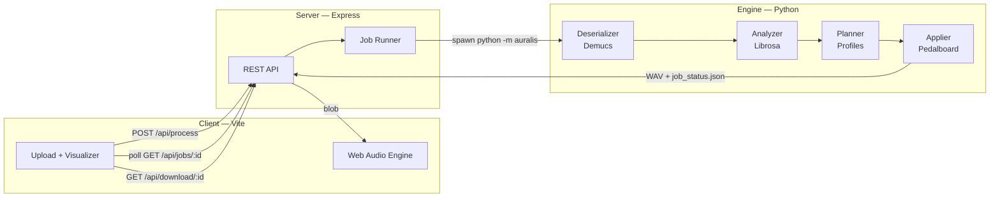

# Architecture

## System diagram

## Request lifecycle

1. **Upload** — Client sends MP3/WAV via `POST /api/process` with a profile name.
2. **Queue** — Server writes `data/renders/<jobId>/job_status.json` (status: `queued`) and spawns the Python engine.
3. **Process** — Engine runs four stages, updating `job_status.json` at each step (8% → 100%).
4. **Poll** — Client calls `GET /api/jobs/:id` every 1.5 s for percent, message, and metadata.
5. **Download** — On `complete`, client fetches the WAV and plays it through Web Audio (bypassing fake stem biquads).
6. **Cleanup** — Upload file is deleted; render directory persists until manually removed.

## Engine stages

| Stage | Module | Output |
|-------|--------|--------|
| Separate | `dsp/deserializer.py` | 4 stem WAVs under `stems/htdemucs/` |
| Analyze | `analysis/analyzer.py` | `profile.json` (BPM, genre, sections, energy) |
| Plan | `analysis/planner.py` | `render_plan.json` (per-stem DSP params) |
| Render | `dsp/applier.py` | Final mixed WAV |

## Profile routing

The planner maps a `SongProfile` + output profile name to `StemEffectParams` for each stem. Vocals and bass stay center-locked; spatial FX (width, reverb, pan LFO) apply to drums and other.

Profiles: `audiophile`, `basshead`, `cinema`, `concert`, `hyper_immersive`, `zenith`.

## Kinetic Engine (immersive profiles)

`analysis/kinetic.py` reads `sections`, `energy_curve`, and `drop_timestamps` from the Librosa profile and emits keyframe envelopes on spatial stems (`drums`, `other`) for `zenith`, `cinema`, `concert`, and `hyper_immersive`.

| Phase | Width / pan | Reverb |
|-------|-------------|--------|
| Verse | Tight (~62% of peak) | ~12% of drop mix |
| Build | 4 s ramp opens | Gradual wet increase |
| Drop | Snap to planner peak | Up to 40% wet on `other` |

The applier runs **parallel dry/wet reverb buses** and crossfades per-sample in NumPy. Width and pan LFO depth also use **per-sample** `np.interp` curves (zero stepping, negligible CPU). Stateful Pedalboard plugins are never re-parameterized mid-buffer.

## Alive features

**Elliptical filter (`dsp/ms.py`):** drums stem gets M/S split with a 200 Hz HPF on Side after widening — kick/snare stay centered, cymbals stay wide.

**Density-aware reverb (`kinetic.py`):** `other` stem reverb envelopes duck during dense sections (chorus) and bloom during sparse passages.

**Safeguard circuit (`safeguard.py`):** pre-master phase check on the stem sum vs source. If L/R correlation drops below `0.15` (or collapses vs source), spatial stems re-render with envelopes and width scaled by `0.7` — preserving the Kinetic arc, not a hard ceiling clamp.

**Zenith AI Score (`scoring.py`):** post-render Immersion / Clarity / Punch / Warmth (0–100) appended to `job_status.json` → `meta.ai_score` for the cassette deck UI.

## Master bus

After stem summing, `dsp/master_bus.py` runs:

1. Profile gain + HPF/LPF + glue compression
2. Integrated LUFS normalization (default −14; Basshead −11.5, Audiophile −16)
3. Pedalboard `Limiter` + sample-peak ceiling at −0.1 dBTP

## Server responsibilities

- **Orchestration only** — no audio processing in Node
- **Process management** — tracks active PIDs, kills on `DELETE /api/jobs/:id`
- **File serving** — streams rendered WAV on download
- **Metadata bridge** — reads `profile.json` on completion, exposes BPM/genre/mood to the visualizer

## Client responsibilities

- Cassette-bay upload UX with decode progress
- Theme system (CSS variables + definitions)
- BPM-synced CRT meters and spindles from server metadata
- `directPlayback` mode: server-rendered audio → `masterGain` → `AnalyserNode`

## Failure modes

| Failure | Behavior |
|---------|----------|
| Python venv missing | `/api/health` returns `ok: false`; spawn errors set job `failed` |
| Demucs timeout / crash | Non-zero exit → job `failed` with stderr |
| Client disconnect mid-job | `DELETE /api/jobs/:id` kills Python, marks cancelled |
| Upload too large | Multer rejects before job is created |
